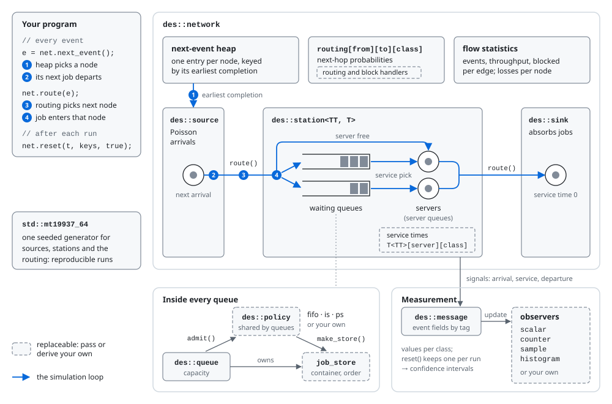

# libdes

**libdes** is a C++ library for discrete-event simulation of queueing networks. You describe a model as sources, service stations and sinks connected by a routing matrix. You attach observers to the quantities you want to measure and run independent replications. The library handles the event list, queues, service disciplines, routing and statistics, and returns confidence intervals for your estimates.

## Features

- **Queueing-network models.** Sources generate Poisson arrivals. Stations have any number of servers and waiting queues, with finite or unlimited capacity and service times drawn from any `<random>` distribution. Sinks absorb completed jobs.
- **Multiple job classes.** Arrival rates, service distributions and routing probabilities are set per class.
- **Queue disciplines.** FIFO, infinite server, processor sharing and weighted generalized processor sharing (GPS). A new discipline is a policy plus a job store, added without changing the library.
- **Routing and blocking.** A probabilistic matrix `routing[from][to][class]` sets the default routes. Optional handlers choose destinations with custom logic, reroute jobs refused by a full node, and pick which waiting queue a free server serves next (e.g. strict priority). Refused and lost jobs are counted.
- **Measurement.** Observers attach to node signals such as arrival and departure and read one event field: sojourn, waiting or service time, or a field you define. `scalar` keeps the mean and variance, `counter` counts events, `sample` stores every observation and `histogram` bins them. The network also tracks throughput and blocking on every edge, and losses at every node.
- **Replications and confidence intervals.** `reset()` closes a run and keeps its statistics. Independent replications then give Student-t confidence intervals, and statistics collected during a warm-up period can be discarded.
- **Reproducible and fast.** One seeded `std::mt19937_64` drives the whole model. Event fields are addressed by integer tags rather than strings, the next event comes from an indexed heap, and event objects are recycled.

## How it works



Your program drives the simulation loop. `next_event()` asks the network's heap for the node whose next job completes first (1), and that job departs (2). `route()` samples the next node from the routing matrix (3) and hands the job over (4). The node starts it on a free server or puts it in a waiting queue. Each queue leaves admission and release order to its policy and the job store the policy creates. Observers attached to node signals collect the statistics. The dashed parts are the ones you can replace with your own. [Architecture](docs/architecture.md) covers the design in detail.

## Quick start

### Requirements

- A C++23 compiler (C++20 also works with `make CXXSTD=c++20`)
- GNU Make
- macOS or Linux

### Build and run the example

```sh
git clone https://github.com/paolocastagno/des.git
cd des
make                          # builds libdes.dylib (macOS) or libdes.so (Linux)
make test LINK_INSTALLED=0    # builds and runs test/test against the library just built
```

[`test/test.cpp`](test/test.cpp) simulates an M/M/1 and an M/M/2 queue over five replications. It prints confidence intervals for throughput and mean sojourn time next to the values from queueing theory. `make test` links against the installed library by default. `LINK_INSTALLED=0` uses the one in the working tree instead.

### A first model

An M/M/1 queue, with arrival rate 0.8 and service rate 1, simulated over five replications of 100 000 events:

```cpp
#include <climits>
#include <iostream>
#include <memory>
#include <random>
#include <vector>

#include <libdes_const.hpp>
#include <libdes_event.hpp>
#include <libdes_network.hpp>
#include <libdes_scalar.hpp>
#include <libdes_sink.hpp>
#include <libdes_source.hpp>
#include <libdes_station.hpp>

using namespace std;

int main()
{
    auto gen = make_shared<mt19937_64>(42);   // one seeded RNG shared by all components

    // Poisson arrivals (rate 0.8) -> one exponential server (rate 1) -> sink
    auto src = make_shared<des::source>(vector<double>{0.8}, "Source", gen);
    auto svc = make_shared<exponential_distribution<double>>(1.0);
    auto sta = make_shared<des::station<double, exponential_distribution>>(
        vector<vector<shared_ptr<exponential_distribution<double>>>>{{svc}},   // [server][class]
        1, 1,          // 1 server, 1 job per server
        1, INT_MAX,    // 1 waiting queue, unlimited capacity
        "M/M/1", gen);
    auto snk = make_shared<des::sink>("Sink");

    // Measure the time jobs spend in the station
    auto sojourn = make_shared<des::scalar>(NODE_SOJOURN, 1);
    sta->attach(SIGNAL_NODE_DEPARTURE, sojourn);

    // routing[from][to][class]: source -> station -> sink
    vector<vector<vector<double>>> routing = {
        {{0}, {1}, {0}},
        {{0}, {0}, {1}},
        {{0}, {0}, {0}}
    };
    des::network net({src, sta, snk}, routing, gen);

    // Bootstrap: one event at the source, which then schedules every arrival
    auto e = make_shared<des::event>();
    e->set_cls(0);
    e->set_time(0.0);
    e->set_info(EVENT_NODE, 0);
    src->arrival(e);

    for (int run = 0; run < 5; ++run)          // 5 independent replications
    {
        double t = 0.0;
        for (int i = 0; i < 100000; ++i)
        {
            e = net.next_event();              // globally earliest event
            t = e->get_time();
            net.route(e);                      // move it to its next node
        }
        net.reset(t, {}, true);                // close the run, keep its statistics
    }

    auto [thr_lo, thr_hi] = net.get_flow_ci(1, 2, 0, 0.05);
    auto [soj_lo, soj_hi] = sojourn->confidence_interval(0.05, 0);
    cout << "Throughput   95% CI [" << thr_lo << ", " << thr_hi << "]  (theory 0.8)\n"
         << "Mean sojourn 95% CI [" << soj_lo << ", " << soj_hi << "]  (theory 5)\n";
}
```

Output with Apple clang (other standard libraries draw different samples):

```
Throughput   95% CI [0.794513, 0.803676]  (theory 0.8)
Mean sojourn 95% CI [4.69121, 5.30995]  (theory 5)
```

The [example walkthrough](docs/examples/basic-network.md) explains each step.

## Using the library

Install the headers and the library system-wide (uses `sudo`; installs to `/usr/local` on macOS and `/usr` on Linux), then compile against it:

```sh
make install
g++ -std=c++23 myprogram.cpp -ldes -o myprogram
```

To use the library from the working tree instead, point the compiler and the runtime linker at it:

```sh
g++ -std=c++23 -I/path/to/des/src myprogram.cpp -L/path/to/des -ldes -Wl,-rpath,/path/to/des -o myprogram
```

On macOS, `libdes.dylib` records `/usr/local/lib` as its location. The program will load an installed copy from there, if one exists, until you redirect it:

```sh
install_name_tool -change /usr/local/lib/libdes.dylib @rpath/libdes.dylib myprogram
```

Common build targets:

| Command | Effect |
|---|---|
| `make` | Release build (`-O3`) |
| `make debug` | Clean debug build (`-O0 -g`) |
| `make CXXSTD=c++20` | Build with another C++ standard |
| `make test` | Build and run `test/test` (add `LINK_INSTALLED=0` for the working-tree library) |
| `make check` / `make validate` | Unit and regression tests / validation against queueing theory |
| `make check-sanitize` / `make coverage` / `make bench` | Tests under sanitizers / coverage report / benchmarks |
| `make install` / `make uninstall` | Install or remove the headers and library system-wide |
| `make clean` / `make clean-lib` | Remove object files / the compiled library |

[Getting Started](docs/getting-started.md) lists all the build options, and the Makefile also has profiling targets (`make profile`). [Testing](docs/testing.md) describes the test pipeline and how to add tests.

## Documentation

| Document | Contents |
|---|---|
| [Getting Started](docs/getting-started.md) | Building, compiling your program, a minimal example |
| [Architecture](docs/architecture.md) | Class hierarchy, design patterns, the simulation loop, replications |
| [API Reference](docs/api/README.md) | Every class, grouped by header |
| [Example: M/M/1](docs/examples/basic-network.md) | Annotated walkthrough of `test/test.cpp` |

Topics you may want to read next:

- [Writing a queue discipline](docs/api/queue.md#implementing-a-custom-policy): LIFO and priority examples
- [Stations](docs/api/station.md): multi-server, processor sharing, GPS and class-priority stations
- [Routing and blocking handlers](docs/api/network.md#custom-handlers)
- [Tags](docs/api/tags.md): adding your own event fields and measuring them

## Repository layout

```
src/     library sources; public headers are src/libdes_*.hpp
test/    test.cpp: M/M/1 and M/M/2 models checked against queueing theory
docs/    user guide and API reference
```

## Notes

- The library is not thread-safe. To run replications in parallel, use separate processes.
- Sources generate exponential inter-arrival times (Poisson arrivals). Service times can follow any distribution.

## Contact

Questions, bug reports and suggestions are welcome as [GitHub issues](https://github.com/paolocastagno/des/issues).
